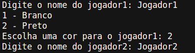
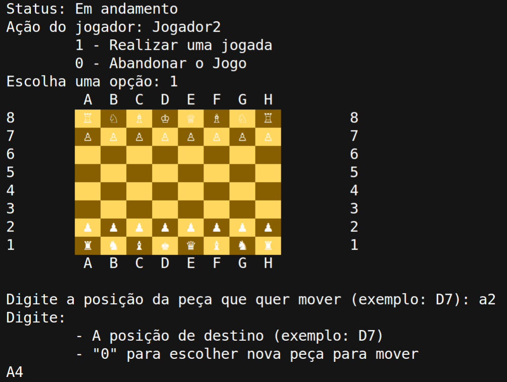
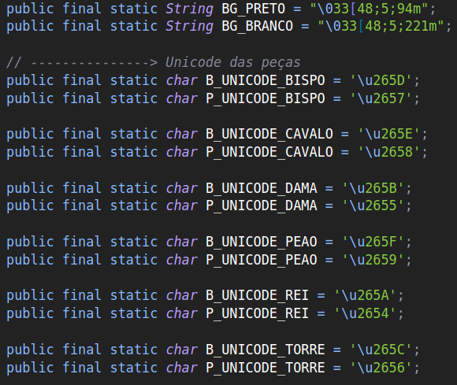

<h1 align="center">♘ Xadrez ♘</h1>

<p>Projeto de xadrez da disciplina Programação Orientada a Objetos do curso de Ciência da Computação.</p>

Tópicos
=================
   * [Sobre o projeto](#sobre-o-projeto)
   * [Features](#features)
   * [Como executar o jogo](#como-executar-o-jogo)
     * [Pré-requisitos](#pré-requisitos)
     * [Executando o jogo](#executando-o-jogo)
     * [Como jogar](#como-jogar)
   * [Customizar](#customização)
   * [Autor](#autor)

## Sobre o projeto

Xadrez é um jogo de tabuleiro no qual o objetivo é derrubar o rei adversário. Este projeto consiste em implementar o jogo utilizando os conceitos de programação orientada a objetos, não sendo obrigatório uma interface gráfica e permitindo o uso da API por terceiros.

## Features

- [x] Parte 1
    - Implementação das peças sem o conceito de herança
    - Implementação parcial das classes ```Jogo```, ```Jogador```, ```Posicao``` e ```Tabuleiro```. Sem a necessidade de ligação entre as classes.
- [X] Parte 2
    - Implementação da classe ```Peça``` e aplicar Herança nas classes das peças de xadrez
    - Estabelecer as relações de todas as classes
    - Implementação do Xeque e Xeque-Mate
    - Deixar o jogo completo e funcional.
- [X] Parte 3
    - Tratar possíveis erros

## Como executar o jogo

### Pré-requisitos

1. Java Development Kit. 
    - Guia de instalação e configuração
        - [Windows](https://giordanolins.com/instalando-o-jdk-java-development-kit-no-windows/)
        - [Linux](https://www.devmedia.com.br/instalacao-e-configuracao-do-pacote-java-jdk/23749)

### Executando o jogo

```bash
# Clone este repositório
$ git clone git@github.com:boolivias/Xadrez-Projeto-POO.git

# Acesse a pasta do projeto no terminal/cmd
$ cd Xadrez-Projeto-POO

# Compila os arquivos e cria os arquivos .class (bytecode)
$ javac *.java

# Executa o .class
$ java Gerenciador

# O jogo será executado no próprio terminal/cmd
```

### Como jogar

#### 1. Começando o jogo

De começo o jogo pede a entrada do nome de um jogador e a sua escolha de cor e então o nome do segundo jogador(sua cor será a restante). Não há restrições nos nomes dos jogadores, porém a escolha da cor é feita utilizando duas opções: **Brancas** ou **Pretas**.

<p align="center">



</p>

#### 2. Realização das jogadas

Sempre ao realizar uma jogada, o tabuleiro é mostrado para ver as posições das peças.

As posições das jogadas é lida pela anotação algébrica das posições, onde primeiro é informado a origem e em seguida o destino. Não há distinção entre letras maiusculas ou minusculas, no entanto é necessário utilizar a ordem de *[Letra][Número]* . Em caso de posições inválidas ou se a origem não tiver peça, o jogo irá informar e pedir uma nova entrada.

<p align="center">



</p>

#### 3. Vitória

A vitória é dada quando o jogador está em Xeque e a vez é do jogador adversário (neste caso o jogador adversário captura o rei automaticamente) ou então o jogador está em Xeque-Mate. Ambos os casos a vitória é dada para o outro jogador.

## Customização

Caso queira alterar as cores do tabuleiro ou as representações das peças, basta alterar os valores das constantes no arquivo `Util/Constantes.java`.

**⚠️DEMAIS ALTERAÇÕES DE VALORES ALÉM DESTES PODEM AFETAR O FUNCIONAMENTO DO JOGO⚠️**

O padrão do nome da peça é feito por *[X]\_UNICODE_[PEÇA]*, onde [X] é **P** ou **B** (preto ou branco) e [PEÇA] o nome da peça de xadrez.

<p align="center">



</p>

---

## Autor

- ### Jean Wylmer ([@boolivias](https://github.com/boolivias))


[](https://github.com/boolivias) [](https://www.linkedin.com/in/jean-wylmer/)